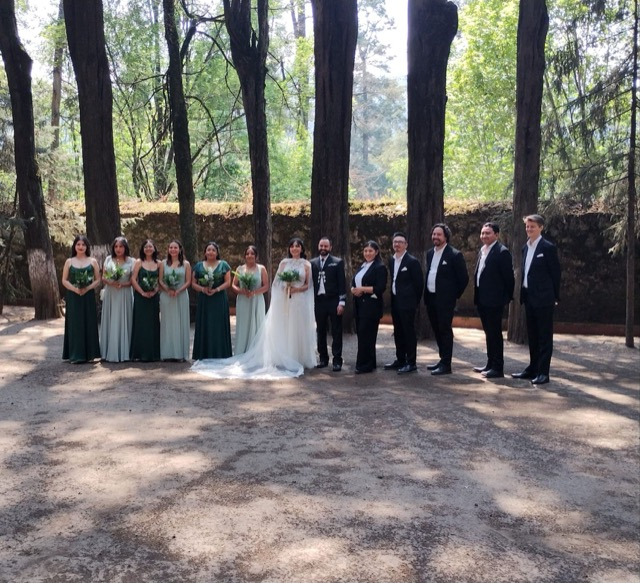

La boda de Dana y Gio, un ritual en medio del bosque. Este matrimonio es la unión consciente de dos almas que han decidido acompañarse, Dana y Gio son artistas sensibles, abiertos el uno al otro, la fuerza de su unión recae en la magia de los eventos que han compartido.

Para esta ceremonia acompañamos de diferentes maneras el proceso de uno de los eventos más significativos de su vida, agradecemos la confianza y apertura de permitirnos reescribir significados en momentos en los que el amor necesita ser expresado sin miedo y con ternura. 

## Arco floral

Para la ceremonia diseñamos un arco de madera con telas, plantas y flores naturales que representa una puerta abierta y viva a nuevos caminos juntos, en el centro del arco se acentuó una nube de flora inspirada en los sueños de esta unión, a los lados enredaderas que abrazan el vínculo y en la base helechos y monsteras que se mantienen firme en la tierra, sosteniendo los pasos que los trajeron a este día.

## Ramos

Usamos diferentes especies de flora verde, creando una pequeña atmósfera medicinal y aromática, para acompañar a cada dama en el camino al altar, siendo sostén y presencia para la novia. 

## Ramo nupcial

Hortencias, helechos, eucalipto, romero y otras especies conformaron este ramo nupcial, el complemento de los novios fue usar cristales de ágata musgosa y obsidiana, él en joyería y ella en su ramo. Apoyo vivo, estas piedras hermosas afirman la conexión con la naturaleza, atraen protección, fortaleza, armonía y paz, además de ser un amuleto de seguridad y confianza. 

## Ceremonia

En el bosque del desierto de los leones se ofició una ceremonia que acentuó la presencia de amor, prosperidad, buenos deseos, así como del desarrollo mutuo y colectivo, que la luz en su camino sea un faro, que el Universo, el sol y las estrellas los acompañen y que las amistades sean un pilar individual para su construcción juntos, todo esto reflejó no solo de la ceremonia, si no, también, de la velada que llena de vitalidad y alegría permitió el reencuentro de dos culturas para reconocerse en la diversidad y alegría de hablar diferentes idiomas en palabra, presencia y movimiento.

## Detrás de cámaras


  <video width=100% controls autoplay>
    <source src="/video/timelapse.mp4" type="video/mp4">
    Your browser does not support the video tag.
</video>
