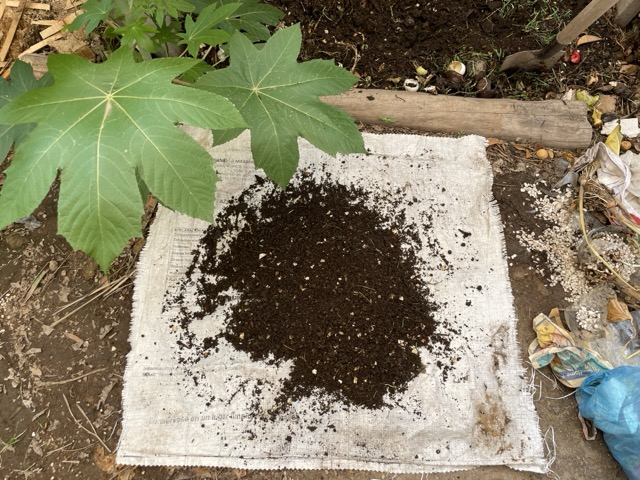
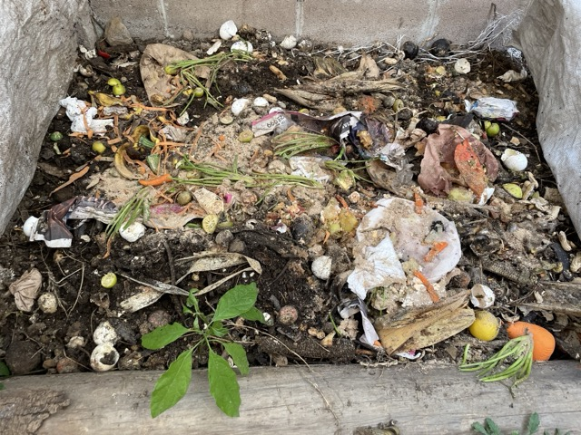
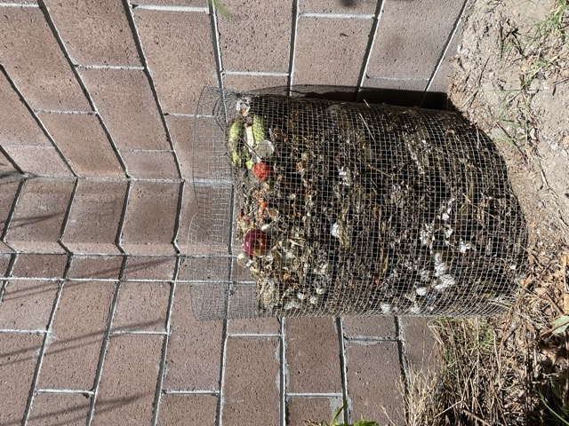
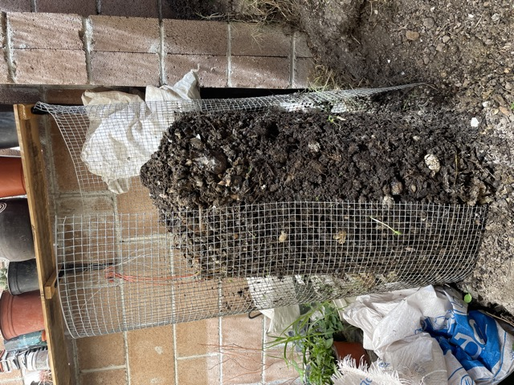

## El cambio

Creemos que Provenzal del Bosque tiene la capacidad de convertirse en el primer fraccionamiento sostenible de Tecámac y marcar el paso para otros fraccionamientos aledaños. Tecámac está cambiando rápidamente y si bien estamos a favor de los distintos tipos de desarrollo que existen, consideramos que esta es una gran oportunidad para la adopción de nuevos valores y modelos de vida sensibles al aprovechamiento de la energía, la disposición de residuos, la producción de alimentos, la libertad de pensamiento, la comunidad, etc. En pocas palabras, estamos hablando de una evolución inteligente del entorno que habitamos.

El compostaje puede tener un papel importante en la evolución de Tecámac y servir de catalizador de cambio. Es un hábito de fácil adopción y que se conecta bien con nuestra predominante cultura de consumo.

## Áreas de compostaje

Los siguientes imágenes muestran algunas áreas de compostaje instaladas en Provenzal del Bosque.

## Naturaleza y compostaje

Hay plantas y árboles saludables que no necesitan la ayuda de los humanos y del compostaje ¿es necesario entonces?

Naturalmente la tierra tiende a mejorar y crear un equilibrio que genera belleza y abundancia pero la proliferación de nuestra especie y algunos de nuestros hábitos como la tala de árboles, la construcción de grandes ciudades y el uso de la naturaleza como un recurso y no un aliado, no facilitan este proceso. Entonces tenemos que "ayudar" devolviendo un poco de lo que la tierra nos da.

### ¿Cómo ayuda el compostaje a Provenzal del Bosque?

- A hacernos responsables de nuestros desechos como consumidores
- Mejoramiento de las áreas verdes
- Combinado con la clasificación de residuos no orgánicos supone un ahorro económico
  + Menos basura en las calles
  + Menos inhundaciones, etc.

### ¿Puedo yo hacer compostaje en mi casa?

Sí, todos podemos, solo hay que encontrar la técnica adecuada para cada caso y de ser complicado se puede optar por un área de compostaje comunal.

### Conclusiones

Sabemos que no todos adoptaremos el hábito del compostaje, sin embargo es posible considerarlo como un tema interesante en términos de nuestra interacción con nuestro entorno y de la responsabilidad que tenemos de disponer los residuos que genera nuestro desarrollo.