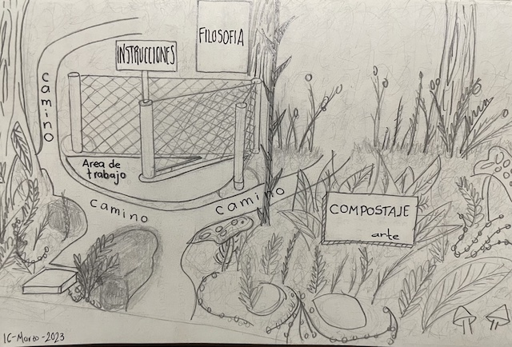
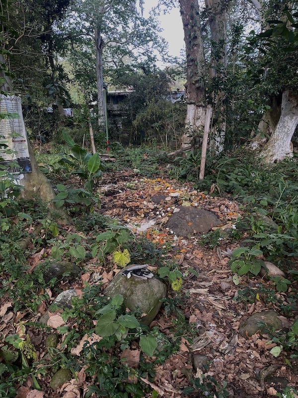
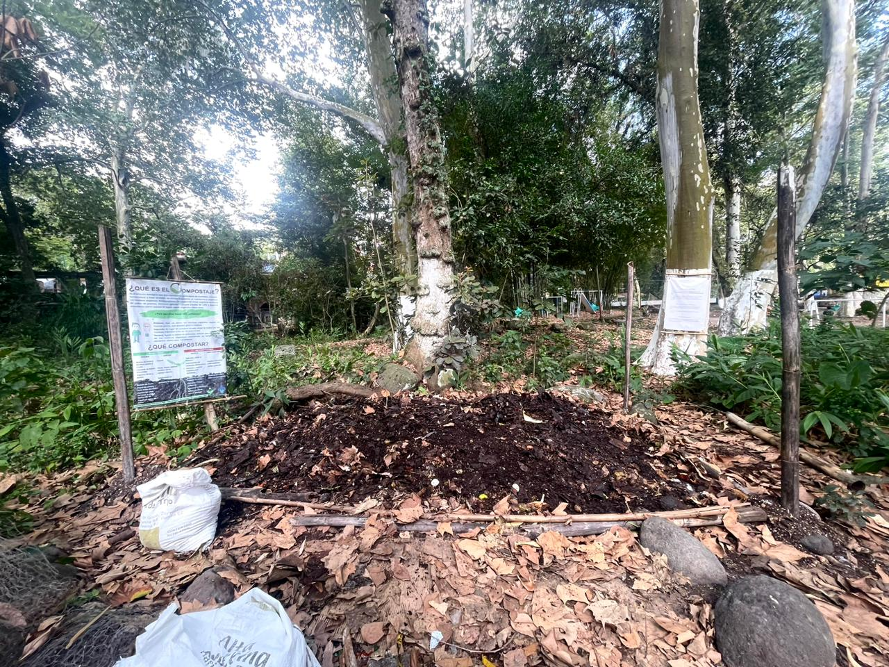
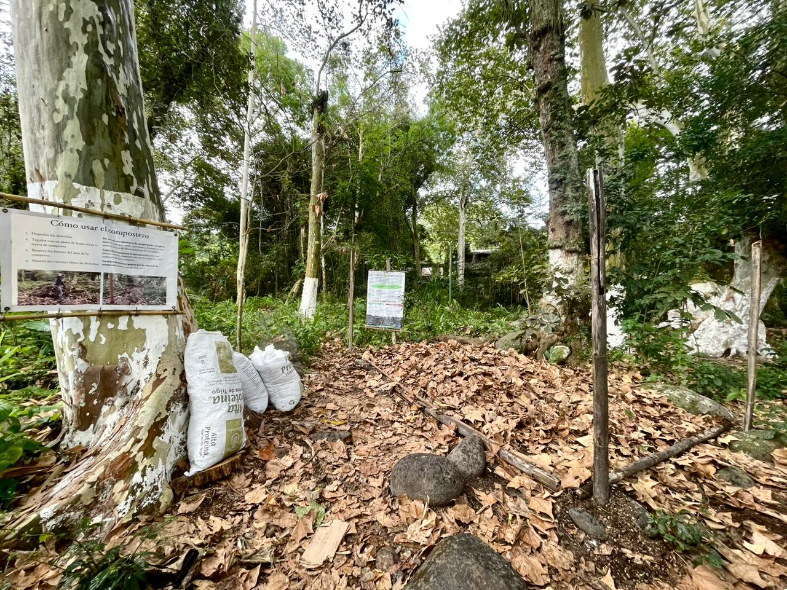

*La existencia de habitantes en cualquier ecosistema en preservación debería involucrar educación sobre el cuidado de su entorno y brindar los recursos informativos necesarios para solventar las necesidades de la comunidad.*

Se identificaron diferentes necesidades en una de las áreas de compostaje ubicadas en la colonia Mariano Escobedo, Veracruz. Fue necesario reacondicionar el espacio para su uso. Se trabajó la propuesta de un diseño basado en los materiales previamente usados para su construcción así como material natural y reciclado.

*La composta es una forma activa de devolver a la tierra.*

**Propuesta**

Diseño del espacio

Al inicio del proyecto se planteo una propuesta para delimitar el espacio de la composta, como se visualiza en la imagen, se contemplaron diferentes caminos para el acceso al area, dentro de la propuesta se tomo en cuenta un letrero para el area de compostaje como señalización y carteles informativos para su uso.

**Área de compostaje antes**

El proyecto nació de un trabajo universitario en el año 2018, después de eso la comunidad de Mariano Escobedo le ha dado uso continuo al incorporar la materia orgánica de sus hogares en el area de compostaje.
El área perdió la forma de manera natural, las especies del lugar crearon un contorno al rededor del espacio, sin embargo, la materia se fue acumulando hasta desbordarse.

**Primer acercamiento de trabajo**

- Aprovechamiento del material existente
- Concentración de composta

**Área de trabajo delimitada**

- Definición de caminos de acceso

Se delimitaron caminos, areas de trabajo y zona de composta, la concentración de materia orgánica nos permitió ver la vida que habitaba el suelo, también nos dejo visualizar mejor la necesidad de los espacios, los caminos se delimitaron removiendo algunas especies para dar forma, se uso bambú para marcar el camino principal y se uso una base de carton que se cubrió con hojas para dar estabilidad y espacio a los usuarios.

**Recolección de hojas para cubrir la composta**

El río Pixquiac atraviesa parte de la colonia Mariano Escobedo, esta zona se encuentra rodeadas de hayas, árbol que provee una gran sombra con su frondoso follaje, al igual que materia de uso como hojas, para el proceso la composta se alimenta no solo de desechos orgánicos, sino también, de hojas secas, tierra y aeración, durante algunas semanas de trabajo se acumularon hojas de este árbol en costales para que cada usuario cubriera su materia ayudando a evitar proliferación de insectos como moscas

**Carteles de divulgación**

- Divulgación del conocimiento
Se colocaron carteles de señalización, uso y filosofía, además se restauro el cartel del proyecto inicial para dar una nueva vista al area de compostaje y brindar el conocimiento básico necesario para que cualquier persona pueda ayudar al desarrollo de la composta.

**Conclusión**

Trabajar en proyectos comunitarios es dar el seguimiento correspondiente a los proyectos, invitar e informar a los participantes sobre el motivo y resultado de la colaboración, buscando que con esto puedan tomar parte y pertenencia de su contribución, el area de compostaje en Mariano Escobedo ahora esta a cargo de los residentes de la zona.