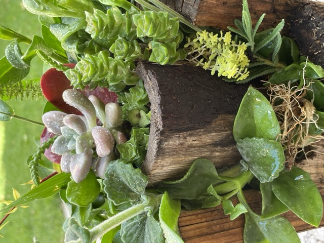
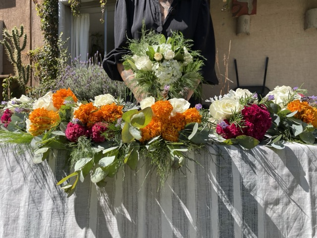
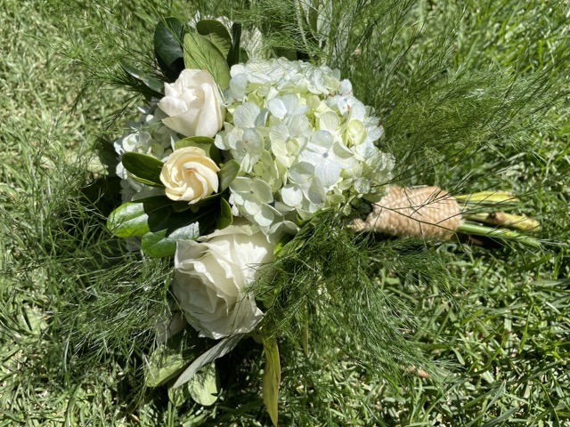

Había una vez una novia con dos amigos muy verdes, para su boda buscaba innovar lo que siempre nos han presentado, nos confió la misión de resignificar sus arreglos florales. Y aquí documentamos esta aventura.

## Petición vs. Solución

### Centros de mesa

Todos alguna vez hemos salido de una fiesta  con uno de ellos, sin embargo, las flores mueren pronto y sus recipientes tarde que temprano terminan en la basura, para este cuento buscamos que la vida perdure, por lo que se diseñaron centros de troncos naturales como macetas para suculentas en base tierra, con esto nos aseguramos que la historia continue.

#### Al terminar el evento

Puedes llevarte la maceta pequeña del centro de mesa como se muestra en el video.


  <video width=100% controls autoplay>
    <source src="/video/regalo.mp4" type="video/mp4">
    Your browser does not support the video tag.
</video>


### Centro de mesa principal

Damos vida a un jardín diverso que acentue la imagen del momento dando color y contraste a los protagonistas de la noche, para este jardín no fue necesario cortar flores pues se montó con macetas, permitiendo armar la escena como un rompecabezas.

#### Representando la flor nacional de México - Dalia

#### Representando la flor nacional de India - Flor de Loto

### Ramo para damas

Estas flores sí que han sido cortadas pero su propósito también es ser una ofrenda, en esta historia la novia es una mujer que se dedica a procurar la salud por lo que nos hemos enfocado en acompañar esta ceremonia desde las bases de la medicina con plantas medicinales y flores de temporada que después podrán ser usadas como ofrenda o sahumerio.

### Ramo para novia

Salud, amor y prosperidad conformado de flores y aromas naturales que nos remontan a nuestra esencia, será la compañía y quizá fortuna de alguien que pueda encontrar el regalo de un deseo, como una pestaña entre los dedos o las velas de un pastel.

### Semillas y flores

Tradicionalmente arrojamos arroz a los novios para desear prosperidad y fertilidad, en este caso replanteamos la intencion reconociendo el inicio de todo como una semilla y el proceso de conocernos en la floración, de esta manera deseamos un constante inicio y exploración de la experiencia de compartirse en un constante renacer personal y mutuo.

_TODOS PODEMOS REESCRIBIR LAS HISTORIAS QUE NOS HAN CONTADO_